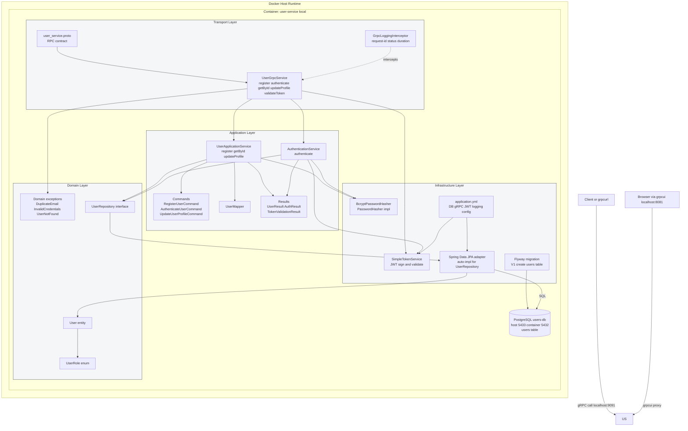
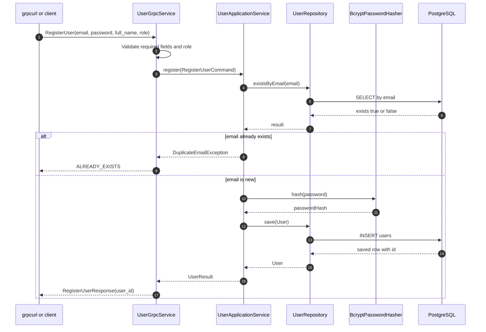
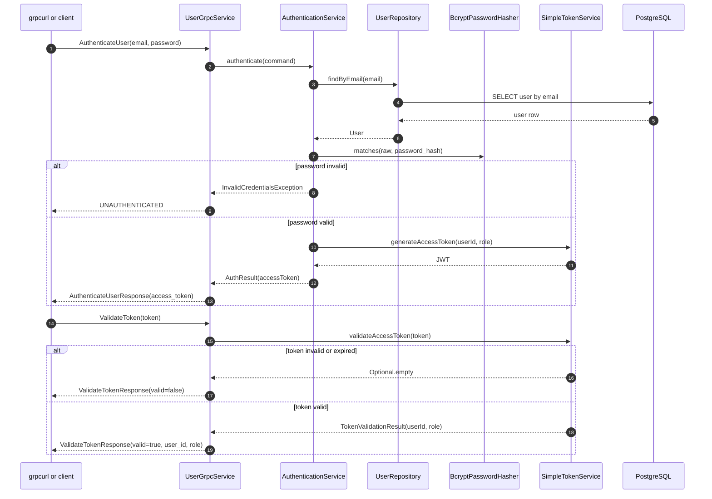

# Architecture - Second Microservice (User Service)

## 1. Purpose
This document explains the architecture of Microservice 2 (user-service), what is already implemented, and what each layer/component does.

Service location:
- services/user-service

Technology:
- Java 17 + Spring Boot 3 + gRPC + PostgreSQL + Flyway

---

## 2. Current Status (What Is Done)
Based on the current codebase and your successful runtime checks:

1. Implemented in different technology than book-service: DONE
- user-service is Java/Spring Boot, while book-service is .NET.

2. gRPC implemented and callable: DONE
- Service and methods are exposed via proto and runtime registration.
- Verified methods:
  - user.v1.UserService.RegisterUser
  - user.v1.UserService.AuthenticateUser
  - user.v1.UserService.GetUserById
  - user.v1.UserService.UpdateUserProfile
  - user.v1.UserService.ValidateToken
- Reflection/health services are also present.

3. Data stored in database: DONE
- PostgreSQL is used.
- Flyway migration creates users table.

4. Logs visible during runtime: DONE
- Structured logs are configured.
- gRPC interceptor logs request lifecycle and request-id.

5. Unit tests implemented: DONE
- Tests exist for application, gRPC service, repository, and security components.

6. Dockerfile builds and runs: DONE
- Docker image user-service:local runs and serves gRPC.

7. GitHub Actions for tests on push: DONE
- Workflow runs mvn -B test for services/user-service changes.

---

## 3. Runtime Topology and Ports
Your current working setup:

1. PostgreSQL container
- Container name: users-db
- Host to container mapping: 5433 -> 5432
- DB URL from host: jdbc:postgresql://localhost:5433/users_db

2. User-service container
- Default gRPC inside container: 9090
- Fallback host mapping you used: 9091 -> 9090
- gRPC test from host: localhost:9091

3. Browser testing
- Direct browser to gRPC port (9091) is expected to fail (gRPC is not plain HTTP page content).
- grpcui can expose a browser UI:
  - 8081 -> 8080 inside grpcui container
  - Open in browser: http://localhost:8081

---

## 4. Layered Architecture

### 4.1 Transport Layer (gRPC API)
Main responsibility:
- Accept external gRPC calls.
- Validate request shape/basic fields.
- Convert transport messages to application commands.
- Map domain/application exceptions to gRPC status codes.

************
Key files:
- services/user-service/src/main/proto/user_service.proto
- services/user-service/src/main/java/si/um/feri/userservice/grpc/service/UserGrpcService.java

What it does:
1. Defines contract for 5 RPC methods in proto.
2. Handles incoming requests in UserGrpcService.
3. Calls application services.
4. Returns gRPC responses.
5. Converts errors to proper statuses:
- ALREADY_EXISTS (duplicate email)
- UNAUTHENTICATED (bad credentials)
- NOT_FOUND (user missing)
- INVALID_ARGUMENT (invalid input)
- INTERNAL (unexpected errors)

### 4.2 Application Layer (Use Cases)
Main responsibility:
- Orchestrate business use cases.
- Coordinate domain and infrastructure contracts.
- Keep use-case logic separated from transport concerns.

**************
Key files:
- services/user-service/src/main/java/si/um/feri/userservice/application/service/UserApplicationService.java
- services/user-service/src/main/java/si/um/feri/userservice/application/service/AuthenticationService.java
- services/user-service/src/main/java/si/um/feri/userservice/application/service/UserMapper.java
- services/user-service/src/main/java/si/um/feri/userservice/application/command/*.java
- services/user-service/src/main/java/si/um/feri/userservice/application/result/*.java

What it does:
1. Register user:
- Checks duplicate email.
- Hashes password via PasswordHasher abstraction.
- Saves entity via repository.
- Maps entity to result DTO.

2. Authenticate user:
- Finds user by email.
- Verifies password hash.
- Generates JWT access token via TokenService abstraction.

3. Profile/query use cases:
- Get user by id.
- Update full name.

### 4.3 Domain Layer (Core Model + Rules)
Main responsibility:
- Represent core user model and business-level exceptions/contracts.

********
Key files:
- services/user-service/src/main/java/si/um/feri/userservice/domain/model/User.java
- services/user-service/src/main/java/si/um/feri/userservice/domain/model/UserRole.java
- services/user-service/src/main/java/si/um/feri/userservice/domain/repository/UserRepository.java
- services/user-service/src/main/java/si/um/feri/userservice/domain/exception/*.java

What it does:
1. User entity maps to users table fields.
2. UserRole enum defines allowed roles (AUTHOR, PUBLISHER, ADMIN, READER).
3. Domain exceptions express business errors.
4. Repository contract defines required persistence operations.

### 4.4 Infrastructure Layer (Adapters)
Main responsibility:
- Implement technical details for persistence, security, and logging.

Key files:
- services/user-service/src/main/java/si/um/feri/userservice/infrastructure/security/BcryptPasswordHasher.java
- services/user-service/src/main/java/si/um/feri/userservice/infrastructure/security/SimpleTokenService.java
- services/user-service/src/main/java/si/um/feri/userservice/infrastructure/logging/GrpcLoggingInterceptor.java
- services/user-service/src/main/resources/application.yml
- services/user-service/src/main/resources/db/migration/V1__create_users_table.sql

What it does:
1. Password hashing with BCrypt.
2. JWT generation and validation (secret + expiration).
3. Global gRPC request logging with request-id in MDC.
4. Spring Data JPA repository implementation (auto-generated from UserRepository interface).
5. Flyway migration for schema creation.
6. Configuration for datasource, gRPC server port, logging, JWT.

### 4.5 Data Layer (PostgreSQL)
Main responsibility:
- Persist user records reliably.

Schema (migration V1):
1. users table fields:
- id (UUID, PK)
- email (UNIQUE)
- password_hash
- full_name
- role
- created_at
- updated_at
2. Email index for lookup.

---

## 5. Request Flows (How Calls Move Through Layers)

### 5.1 RegisterUser
1. gRPC request arrives at UserGrpcService.registerUser.
2. Input fields checked (email/password/full_name/role).
3. RegisterUserCommand created.
4. UserApplicationService.register executes use case.
5. UserRepository checks duplicate email.
6. PasswordHasher hashes password.
7. User saved to PostgreSQL.
8. user_id returned in RegisterUserResponse.

### 5.2 AuthenticateUser
1. gRPC request arrives at authenticateUser.
2. AuthenticationService.authenticate runs.
3. User loaded by email.
4. BCrypt hash match validated.
5. JWT created by TokenService.
6. access_token returned.

### 5.3 ValidateToken
1. gRPC request arrives at validateToken.
2. TokenService validates JWT signature + claims.
3. Returns valid true/false.
4. If valid, also returns user_id and role.

---

## 6. Logging and Observability

What is implemented:
1. gRPC interceptor logs request start and finish with method, status, duration.
2. Request-id propagation via x-request-id header or generated UUID.
3. Log pattern includes request-id and logger/thread context.

Why it matters:
1. Easier debugging across distributed calls.
2. Better traceability for failures and latency.

---

## 7. Error Handling Strategy

In UserGrpcService, exceptions are translated into protocol-level outcomes:
1. DuplicateEmailException -> ALREADY_EXISTS
2. InvalidCredentialsException -> UNAUTHENTICATED
3. UserNotFoundException -> NOT_FOUND
4. Invalid request fields/UUID/role -> INVALID_ARGUMENT
5. Unknown exceptions -> INTERNAL

This gives clients stable and predictable error semantics.

---

## 8. Testing and CI

Tests present:
- services/user-service/src/test/java/si/um/feri/userservice/UserServiceApplicationTests.java
- services/user-service/src/test/java/si/um/feri/userservice/application/service/AuthenticationServiceTest.java
- services/user-service/src/test/java/si/um/feri/userservice/application/service/UserApplicationServiceTest.java
- services/user-service/src/test/java/si/um/feri/userservice/domain/repository/UserRepositoryTest.java
- services/user-service/src/test/java/si/um/feri/userservice/grpc/service/UserGrpcServiceTest.java
- services/user-service/src/test/java/si/um/feri/userservice/infrastructure/security/BcryptPasswordHasherTest.java
- services/user-service/src/test/java/si/um/feri/userservice/infrastructure/security/SimpleTokenServiceTest.java

CI workflow:
- .github/workflows/user-service.yml
- Trigger on push affecting user-service paths.
- Runs mvn -B test in services/user-service.

---

## 9. One-Screen Mental Model
Think of user-service as:

1. gRPC contract boundary (proto + grpc service)
2. Use-case orchestrators (application services)
3. Core business model and contracts (domain)
4. Technical adapters (security, logging, persistence, migration, config)
5. PostgreSQL storage

Call path in one line:
Client -> gRPC method -> application service -> repository/security adapter -> PostgreSQL/JWT -> response

---

## 10. Suggested Next Improvements
1. Add dedicated API error codes/messages in proto for richer client handling.
2. Add integration test container profile for full end-to-end grpc + db tests.
3. Add metrics export (Prometheus/OpenTelemetry) for request rate/latency.
4. Add role-based authorization checks for sensitive methods.

---

## 11. Architecture Diagrams (Detailed)

### 11.1 Component Diagram (Runtime + Layers)

### 11.2 RegisterUser Sequence

### 11.3 Authenticate and ValidateToken Sequence

┌─────────────────────────────────────┐
│ KLIJENT (grpcurl ili aplikacija)   │
└────────────────┬────────────────────┘
                 │
         ┌───────▼────────┐
         │  gRPC PORT:9091│
         └───────┬────────┘
                 │
    ┌────────────▼─────────────┐
    │ TRANSPORT SLOJ           │
    │ ├─ user_service.proto    │
    │ ├─ UserGrpcService       │
    │ └─ GrpcLoggingInterceptor│
    └────────────┬─────────────┘
                 │
    ┌────────────▼──────────────────┐
    │ APPLICATION SLOJ             │
    │ ├─ UserApplicationService    │
    │ ├─ AuthenticationService     │
    │ ├─ UserMapper               │
    │ └─ Commands & Results        │
    └────────────┬──────────────────┘
                 │
    ┌────────────▼─────────────────┐
    │ DOMAIN SLOJ                 │
    │ ├─ User entity              │
    │ ├─ UserRole enum            │
    │ ├─ UserRepository interface │
    │ └─ Domain exceptions        │
    └────────────┬─────────────────┘
                 │
    ┌────────────▼────────────────────┐
    │ INFRASTRUCTURE SLOJ            │
    │ ├─ BcryptPasswordHasher        │
    │ ├─ SimpleTokenService         │
    │ ├─ Spring Data JPA            │
    │ ├─ configuration (application.yml) │
    │ └─ Flyway migrations          │
    └────────────┬────────────────────┘
                 │
    ┌────────────▼────────────────────┐
    │ PostgreSQL (PORT: 5433)        │
    │ ├─ users table                │
    │ └─ email index                │
    └───────────────────────────────┘