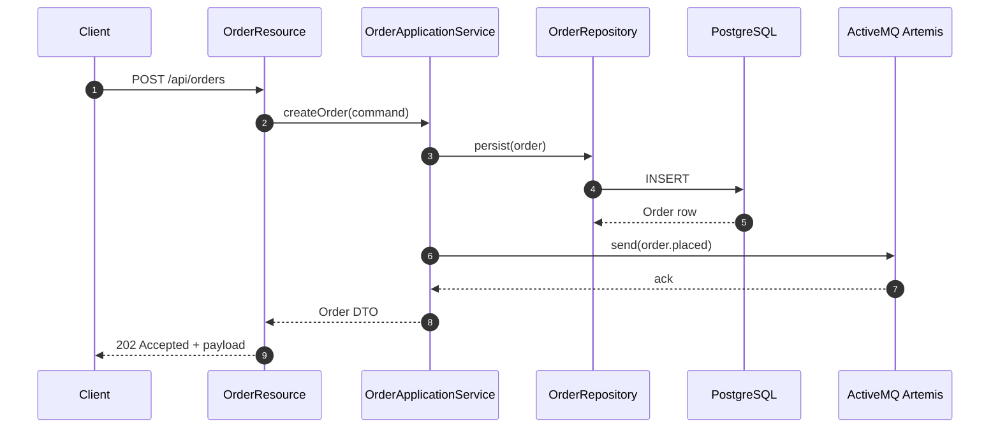
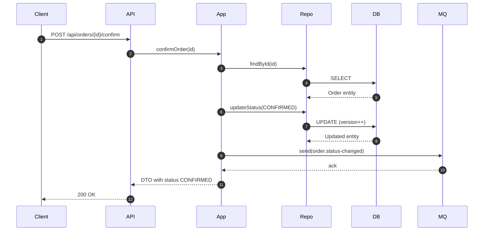

# Architecture - Third Microservice (Order Service)

## 1. Purpose & Scope
This document captures the **target architecture** for Microservice 3 (`order-service`). It will guide implementation, reviews, and documentation for Naloga 4. The service owns the preorder/order domain, exposes a reactive REST API, persists data independently, and publishes events via ActiveMQ Artemis so downstream services (notification, analytics) remain decoupled.

Key requirements satisfied by this architecture:
- Different technology stack (Quarkus 3 + Mutiny)
- Reactive HTTP + persistence pipeline
- Message broker integration (ActiveMQ)
- Structured logging + health endpoints
- Testability and CI/CD friendliness

## Implementation Progress

| Phase | Component | Status | Tests | Files |
| --- | --- | --- | --- | --- |
| Part 1 | Domain Layer | ✅ Complete | 8 passing | OrderEntity, OrderStatus, OrderRepository, Migrations |
| Part 2 | Application Services | ✅ Complete | 18 passing | OrderApplicationService, DTOs, Exceptions Mapper |
| Part 3 | REST API / Transport | ✅ Complete | 4 passing | OrderResource, ExceptionMapper, ErrorResponse, Filter |
| **Total** | **All Layers** | **✅ Complete** | **30/30 passing** | **17 source files** |

## 2. Responsibilities
1. Accept and validate preorder requests for books
2. Persist order lifecycle state transitions (`PENDING`, `CONFIRMED`, `CANCELLED`, `FULFILLED`)
3. Publish domain events (`order.placed`, `order.status-changed`) to broker topics
4. Provide filtered queries for dashboards (by book, user, status)
5. Offer hooks for future payment and fulfillment integrations

Out of scope for MVP: actual payment capture, refunds, or complex saga coordination (these are future extensions).

## 3. Technology Stack
| Layer | Technology |
| --- | --- |
| Language / Runtime | Java 21, Quarkus 3 (Mutiny, Vert.x) |
| HTTP API | `quarkus-rest` (JAX-RS reactive), `SmallRye OpenAPI` |
| Persistence | PostgreSQL 15, Hibernate Reactive with Panache, Flyway migrations |
| Messaging | ActiveMQ Artemis, SmallRye Reactive Messaging (JMS connector) |
| Serialization | JSON (REST), JSON payloads for events |
| Validation | Jakarta Bean Validation |
| Logging/Observability | Quarkus logging-json, Micrometer Prometheus metrics, Health endpoints |
| Testing | JUnit 5, REST Assured, Testcontainers (PostgreSQL + Artemis) |

## 4. Component & Layer Diagram
```mermaid
digraph G {
  rankdir=LR;
  subgraph cluster_transport {
    label="Transport Layer";
    style=dashed;
    Api["OrderResource (REST)"];
    Filters["Request Filters\n(Mutiny + validation)"];
    Api -> Filters;
  }

  subgraph cluster_application {
    label="Application Layer";
    style=dashed;
    Service["OrderApplicationService\n(use cases)"];
    Mapper["OrderMapper"];
    Service -> Mapper;
  }

  subgraph cluster_domain {
    label="Domain Layer";
    style=dashed;
    Entity["Order aggregate"];
    Status["OrderStatus enum"];
    Repository["OrderRepository (Panache)"];
    Entity -> Status;
    Repository -> Entity;
  }

  subgraph cluster_infra {
    label="Infrastructure";
    style=dashed;
    DB["PostgreSQL 15\n(Hibernate Reactive)"];
    Broker["ActiveMQ Artemis"];
    Events["Reactive Messaging Channel"];
    Logger["Logging + Metrics"];
    Repository -> DB;
    Events -> Broker;
  }

  Api -> Service;
  Service -> Repository;
  Service -> Events;
  Service -> Logger;
}
```

**Flow summary**: HTTP request enters `OrderResource`, validated via bean validation + custom filters, handled by `OrderApplicationService`, which orchestrates persistence (through reactive repository) and event emission (through messaging channel). Observability hooks capture metrics/logs at each boundary.

## Part 2: Application Services Layer

### 5.1 Purpose & Responsibilities

The **Application Service Layer** (`OrderApplicationService`) sits between the transport layer (REST API) and the domain layer. It acts as a **use-case orchestrator** that:

1. **Validates user input** - Ensures all request data meets business constraints
2. **Enforces business rules** - Prevents invalid state transitions and maintains order integrity
3. **Coordinates domain operations** - Combines multiple domain entities/repositories into coherent workflows
4. **Translates between DTOs and domain entities** - Maps request/response objects bidirectionally
5. **Manages transactions** - Ensures atomic persistence of state changes (handled by framework)
6. **Emits domain events** - Signals important state changes to external systems via messaging

### 5.2 Order Application Service Methods

#### `createOrder(CreateOrderRequest) -> Uni<OrderResponse>`
**Purpose**: Create a new preorder for a book.

**Business Rules**:
- `bookId`, `userId`, `quantity`, and `price` are all required
- `quantity` must be positive (> 0)
- `price` must be positive (> 0)

**Flow**:
1. Validate input against constraints → throw `OrderValidationException` if invalid
2. Invoke domain factory `OrderEntity.create()` which enforces invariants
3. Persist to database via reactive repository
4. Emit `order.placed` event to broker
5. Return order DTO with status = `PENDING`

**Error Cases**:
- `OrderValidationException` (400) - Missing or invalid fields
- Database constraint violation (500) - Data integrity error

---

#### `getOrderById(UUID) -> Uni<OrderResponse>`
**Purpose**: Retrieve an existing order by its unique identifier.

**Business Rules**:
- Order must exist in database
- `orderId` cannot be null

**Flow**:
1. Validate orderId is not null
2. Query database for order
3. If not found → throw `OrderNotFoundException` (404)
4. Map entity to DTO and return

**Error Cases**:
- `OrderNotFoundException` (404) - Order does not exist
- Database connection error (500) - Infrastructure failure

---

#### `confirmOrder(UUID) -> Uni<OrderResponse>`
**Purpose**: Transition an order from `PENDING` to `CONFIRMED` status.

**Business Rules**:
- Only orders with `status = PENDING` can be confirmed
- State transition is immutable (checks optimistic locking via `@Version`)

**Flow**:
1. Retrieve order by ID (throws if not found)
2. Check current status == PENDING
3. If not PENDING → throw `InvalidOrderStateTransitionException` (409)
4. Invoke `order.updateStatus(CONFIRMED)` on domain entity
5. Persist updated entity to database
6. Emit `order.status-changed` event to broker
7. Return updated DTO

**Error Cases**:
- `OrderNotFoundException` (404) - Order does not exist
- `InvalidOrderStateTransitionException` (409) - Order not in PENDING state
- Optimistic lock exception (409) - Concurrent modification detected

---

#### `cancelOrder(UUID) -> Uni<OrderResponse>`
**Purpose**: Transition an order to `CANCELLED` status.

**Business Rules**:
- Only non-terminal orders can be cancelled
- Terminal states: `CANCELLED`, `FULFILLED` (cannot transition out)
- From PENDING or CONFIRMED → can go to CANCELLED

**Flow**:
1. Retrieve order by ID (throws if not found)
2. Check if order status is terminal via `order.getStatus().isTerminal()`
3. If terminal → throw `InvalidOrderStateTransitionException` (409)
4. Invoke `order.updateStatus(CANCELLED)` on domain entity
5. Persist updated entity to database
6. Emit `order.status-changed` event to broker
7. Return updated DTO

**Error Cases**:
- `OrderNotFoundException` (404) - Order does not exist
- `InvalidOrderStateTransitionException` (409) - Order in terminal state

---

#### `fulfillOrder(UUID) -> Uni<OrderResponse>`
**Purpose**: Transition an order from `CONFIRMED` to `FULFILLED` status.

**Business Rules**:
- Only orders with `status = CONFIRMED` can be fulfilled
- Represents completion of the order lifecycle

**Flow**:
1. Retrieve order by ID (throws if not found)
2. Check current status == CONFIRMED
3. If not CONFIRMED → throw `InvalidOrderStateTransitionException` (409)
4. Invoke `order.updateStatus(FULFILLED)` on domain entity
5. Persist updated entity to database
6. Emit `order.status-changed` event to broker
7. Return updated DTO

**Error Cases**:
- `OrderNotFoundException` (404) - Order does not exist
- `InvalidOrderStateTransitionException` (409) - Order not in CONFIRMED state

### 5.3 Exception Hierarchy

The application service defines custom exceptions to represent business rule violations:

```
OrderException (base, abstract)
├── OrderValidationException
│   └── Thrown when input validation fails
│   └── HTTP: 400 Bad Request
│
├── OrderNotFoundException
│   └── Thrown when referenced order does not exist
│   └── HTTP: 404 Not Found
│
├── InvalidOrderStateTransitionException
│   └── Thrown when attempting illegal state transition
│   └── HTTP: 409 Conflict
│
└── OrderDomainException
    └── Thrown for domain invariant violations
    └── HTTP: 422 Unprocessable Entity
```

**Benefits**:
- Semantic clarity - exception name reveals business rule violated
- Consistent handling - framework can map each exception type to HTTP status
- Testability - unit tests verify correct exception thrown for each scenario

### 5.4 DTOs and Mapping

**Request DTOs** (from client):
```java
CreateOrderRequest {
    UUID bookId;           // Which book?
    UUID userId;           // Who is ordering?
    int quantity;          // How many copies?
    BigDecimal price;      // Unit price at order time
}

UpdateOrderStatusRequest {
    OrderStatus newStatus;  // Target status (CONFIRMED, CANCELLED, FULFILLED)
}
```

**Response DTO** (to client):
```java
OrderResponse {
    UUID id;                // Order identifier
    UUID bookId;            // Associated book
    UUID userId;            // Ordering user
    int quantity;           // Number of items
    BigDecimal price;       // Unit price
    OrderStatus status;     // Current state (PENDING, CONFIRMED, etc.)
    LocalDateTime createdAt; // Order creation timestamp
    LocalDateTime updatedAt; // Last status change timestamp
}
```

**Mapper responsibilities** (`OrderMapper`):
- Convert domain `OrderEntity` → `OrderResponse` DTO (read path)
- Extract and validate fields from DTOs before passing to domain (write path)
- Handle null safety and immutability
- Ensure timestamps are correctly preserved

### 5.5 Transaction & Reactive Semantics

Each application service method follows this pattern:

```java
public Uni<OrderResponse> someMethod(params) {
    // 1. Validation (local, no DB calls)
    validateInput(params);
    
    // 2. Database query (reactive Uni)
    return repository.findById(id)
        .onItem().ifNull().failWith(() -> new NotFoundException())
        
        // 3. Domain logic (on retrieved item)
        .map(entity -> {
            // Enforce business rules
            if (!canTransition(entity)) {
                throw new InvalidStateException();
            }
            // Mutate entity state
            entity.updateStatus(newStatus);
            return entity;
        })
        
        // 4. Persist (chain into next Uni)
        .chain(entity -> repository.persistAndFlush(entity))
        
        // 5. Emit event (no-op chain to fire-and-forget)
        .onItem().call(entity -> emitEvent(entity))
        
        // 6. Convert to DTO for response
        .map(mapper::toDto);
}
```

**Key points**:
- All operations are **non-blocking** (Mutiny `Uni`)
- Database transaction wraps steps 2-4 automatically
- Event emission (step 5) happens **after** DB commit
- Response produced only after all steps succeed
- Exceptions propagate through chain and become HTTP error responses

### 5.6 Input Validation Strategy

Validation occurs in two layers:

1. **Framework validation** (JAX-RS / Bean Validation):
   - `@NotNull`, `@Min`, `@Max`, `@Email` annotations on DTO fields
   - Automatic, declarative, produces 400 responses

2. **Application service validation** (custom logic):
   - Business rule checks: "Can this order transition to that status?"
   - Complex predicates: "Is this combination of fields allowed?"
   - Throws domain exceptions for semantic clarity

```java
private void validateCreateOrderRequest(CreateOrderRequest request) {
    if (request == null) 
        throw new OrderValidationException("Request cannot be null");
    if (request.getBookId() == null) 
        throw new OrderValidationException("bookId is required");
    if (request.getQuantity() <= 0) 
        throw new OrderValidationException("quantity must be positive");
    if (request.getPrice().compareTo(BigDecimal.ZERO) <= 0)
        throw new OrderValidationException("price must be positive");
}
```

### 5.7 Part 2 Testing Strategy

Unit tests verify each application service method in isolation:

**Test Categories**:
1. **Happy path tests** - Valid input, successful execution
2. **Validation tests** - Invalid input rejected with correct exception
3. **State transition tests** - Valid and invalid state transitions
4. **Error handling tests** - Exceptions from repository, domain logic

**Mocking approach**:
- Mock `OrderRepository` to control database responses
- Mock `OrderMapper` to focus on service orchestration logic
- Use Mockito `@InjectMock` and `@Mock`
- Stub Mutiny `Uni` values for reactive testing

**Example test**:
```java
@Test
void testConfirmOrderWhenPendingSucceeds() {
    // Arrange
    UUID orderId = UUID.randomUUID();
    OrderEntity pending = OrderEntity.of(orderId, ..., OrderStatus.PENDING);
    when(repository.findById(orderId)).thenReturn(Uni.createFrom().item(pending));
    when(repository.persistAndFlush(any())).thenReturn(Uni.createFrom().item(pending.withStatus(CONFIRMED)));
    
    // Act
    OrderResponse result = service.confirmOrder(orderId).await().indefinitely();
    
    // Assert
    assertEquals(OrderStatus.CONFIRMED, result.getStatus());
    verify(repository).persistAndFlush(any());
}
```

### 5.8 Integration with REST API

The REST endpoint calls the application service:

```java
@Path("/api/orders")
public class OrderResource {
    
    @Inject
    OrderApplicationService service;
    
    @POST
    public Uni<Response> createOrder(CreateOrderRequest request) {
        return service.createOrder(request)
            .map(dto -> Response.status(202).entity(dto).build());
    }
    
    @GET
    @Path("{id}")
    public Uni<Response> getOrder(@PathParam("id") UUID orderId) {
        return service.getOrderById(orderId)
            .map(dto -> Response.ok(dto).build())
            .onFailure(OrderNotFoundException.class)
            .recoverWithItem(() -> Response.status(404).build());
    }
    
    @POST
    @Path("{id}/confirm")
    public Uni<Response> confirmOrder(@PathParam("id") UUID orderId) {
        return service.confirmOrder(orderId)
            .map(dto -> Response.ok(dto).build());
    }
}
```

## Part 3: REST API / Transport Layer

### 6.1 Purpose & Responsibilities

The **Transport Layer** (`OrderResource`) is the HTTP boundary of the order service. It acts as the **API gateway** for client interactions and is responsible for:

1. **Exposing REST endpoints** - Standard HTTP methods for order operations
2. **Request validation** - Framework-level validation (Bean Validation annotations)
3. **Error handling** - Converting domain exceptions to HTTP response codes
4. **Response formatting** - JSON serialization with proper status codes
5. **Correlation tracking** - Injecting request IDs for distributed tracing
6. **Reactive streaming** - Returning `Uni<Response>` for non-blocking execution

### 6.2 REST Endpoint Definitions

#### Endpoint 1: Create an Order
```
POST /api/orders
Content-Type: application/json

Request Body:
{
  "bookId": "550e8400-e29b-41d4-a716-446655440000",
  "userId": "660e8400-e29b-41d4-a716-446655440001",
  "quantity": 5,
  "price": 29.99
}

Success Response:
HTTP 202 Accepted
{
  "id": "770e8400-e29b-41d4-a716-446655440002",
  "bookId": "550e8400-e29b-41d4-a716-446655440000",
  "userId": "660e8400-e29b-41d4-a716-446655440001",
  "quantity": 5,
  "price": 29.99,
  "status": "PENDING",
  "createdAt": "2026-03-28T20:30:00Z",
  "updatedAt": "2026-03-28T20:30:00Z"
}

Error Responses:
- 400 Bad Request: Missing/invalid fields or validation fails
- 500 Internal Server Error: Database/broker failure
```

**Handler Method**:
```java
@POST
@Produces(MediaType.APPLICATION_JSON)
@Consumes(MediaType.APPLICATION_JSON)
public Uni<Response> createOrder(CreateOrderRequest request) {
    // Framework validates request body via Bean Validation
    // Pass to application service
    return orderApplicationService.createOrder(request)
        .map(dto -> Response.status(202).entity(dto).build())
        .onFailure(OrderValidationException.class)
        .recoverWithItem(ex -> Response.status(400)
            .entity(new ErrorResponse("VALIDATION_ERROR", ex.getMessage()))
            .build());
}
```

---

#### Endpoint 2: Retrieve an Order
```
GET /api/orders/{orderId}

Success Response:
HTTP 200 OK
{
  "id": "770e8400-e29b-41d4-a716-446655440002",
  "bookId": "550e8400-e29b-41d4-a716-446655440000",
  "userId": "660e8400-e29b-41d4-a716-446655440001",
  "quantity": 5,
  "price": 29.99,
  "status": "PENDING",
  "createdAt": "2026-03-28T20:30:00Z",
  "updatedAt": "2026-03-28T20:30:00Z"
}

Error Responses:
- 404 Not Found: Order ID does not exist
- 400 Bad Request: Invalid UUID format
```

**Handler Method**:
```java
@GET
@Path("{orderId}")
@Produces(MediaType.APPLICATION_JSON)
public Uni<Response> getOrder(@PathParam("orderId") UUID orderId) {
    return orderApplicationService.getOrderById(orderId)
        .map(dto -> Response.ok(dto).build())
        .onFailure(OrderNotFoundException.class)
        .recoverWithItem(ex -> Response.status(404)
            .entity(new ErrorResponse("NOT_FOUND", ex.getMessage()))
            .build());
}
```

---

#### Endpoint 3: Confirm an Order
```
POST /api/orders/{orderId}/confirm

Success Response:
HTTP 200 OK
{
  "id": "770e8400-e29b-41d4-a716-446655440002",
  "bookId": "550e8400-e29b-41d4-a716-446655440000",
  "userId": "660e8400-e29b-41d4-a716-446655440001",
  "quantity": 5,
  "price": 29.99,
  "status": "CONFIRMED",
  "createdAt": "2026-03-28T20:30:00Z",
  "updatedAt": "2026-03-28T20:31:00Z"
}

Error Responses:
- 404 Not Found: Order does not exist
- 409 Conflict: Order is not in PENDING status (e.g., already CONFIRMED)
- 400 Bad Request: Invalid UUID format
```

**Handler Method**:
```java
@POST
@Path("{orderId}/confirm")
@Produces(MediaType.APPLICATION_JSON)
public Uni<Response> confirmOrder(@PathParam("orderId") UUID orderId) {
    return orderApplicationService.confirmOrder(orderId)
        .map(dto -> Response.ok(dto).build())
        .onFailure(InvalidOrderStateTransitionException.class)
        .recoverWithItem(ex -> Response.status(409)
            .entity(new ErrorResponse("INVALID_STATE_TRANSITION", ex.getMessage()))
            .build());
}
```

---

#### Endpoint 4: Cancel an Order
```
POST /api/orders/{orderId}/cancel

Success Response:
HTTP 200 OK
{
  "id": "770e8400-e29b-41d4-a716-446655440002",
  "bookId": "550e8400-e29b-41d4-a716-446655440000",
  "userId": "660e8400-e29b-41d4-a716-446655440001",
  "quantity": 5,
  "price": 29.99,
  "status": "CANCELLED",
  "createdAt": "2026-03-28T20:30:00Z",
  "updatedAt": "2026-03-28T20:35:00Z"
}

Error Responses:
- 404 Not Found: Order does not exist
- 409 Conflict: Order is already in terminal state (CANCELLED, FULFILLED)
- 400 Bad Request: Invalid UUID format
```

**Handler Method**:
```java
@POST
@Path("{orderId}/cancel")
@Produces(MediaType.APPLICATION_JSON)
public Uni<Response> cancelOrder(@PathParam("orderId") UUID orderId) {
    return orderApplicationService.cancelOrder(orderId)
        .map(dto -> Response.ok(dto).build())
        .onFailure(InvalidOrderStateTransitionException.class)
        .recoverWithItem(ex -> Response.status(409)
            .entity(new ErrorResponse("INVALID_STATE_TRANSITION", ex.getMessage()))
            .build());
}
```

---

#### Endpoint 5: Fulfill an Order
```
POST /api/orders/{orderId}/fulfill

Success Response:
HTTP 200 OK
{
  "id": "770e8400-e29b-41d4-a716-446655440002",
  "bookId": "550e8400-e29b-41d4-a716-446655440000",
  "userId": "660e8400-e29b-41d4-a716-446655440001",
  "quantity": 5,
  "price": 29.99,
  "status": "FULFILLED",
  "createdAt": "2026-03-28T20:30:00Z",
  "updatedAt": "2026-03-28T20:40:00Z"
}

Error Responses:
- 404 Not Found: Order does not exist
- 409 Conflict: Order is not in CONFIRMED status
- 400 Bad Request: Invalid UUID format
```

**Handler Method**:
```java
@POST
@Path("{orderId}/fulfill")
@Produces(MediaType.APPLICATION_JSON)
public Uni<Response> fulfillOrder(@PathParam("orderId") UUID orderId) {
    return orderApplicationService.fulfillOrder(orderId)
        .map(dto -> Response.ok(dto).build())
        .onfailure(InvalidOrderStateTransitionException.class)
        .recoverWithItem(ex -> Response.status(409)
            .entity(new ErrorResponse("INVALID_STATE_TRANSITION", ex.getMessage()))
            .build());
}
```

### 6.3 Exception Handling Strategy

The REST layer converts domain exceptions into HTTP responses using an **Exception Mapper**:

```java
@Provider
public class OrderExceptionMapper implements ExceptionMapper<OrderException> {
    
    @Override
    public Response toResponse(OrderException exception) {
        
        if (exception instanceof OrderNotFoundException) {
            return Response.status(404)
                .entity(new ErrorResponse(
                    "ORDER_NOT_FOUND",
                    exception.getMessage()))
                .build();
        }
        
        if (exception instanceof InvalidOrderStateTransitionException) {
            return Response.status(409)
                .entity(new ErrorResponse(
                    "INVALID_STATE_TRANSITION",
                    exception.getMessage()))
                .build();
        }
        
        if (exception instanceof OrderValidationException) {
            return Response.status(400)
                .entity(new ErrorResponse(
                    "VALIDATION_ERROR",
                    exception.getMessage()))
                .build();
        }
        
        // Default to 500 for unknown domain exceptions
        return Response.status(500)
            .entity(new ErrorResponse(
                "INTERNAL_ERROR",
                "An unexpected error occurred"))
            .build();
    }
}
```

**Benefits**:
- Consistent error format across all endpoints
- Semantic HTTP status codes
- Single point for exception handling logic
- Easy to audit and extend

### 6.4 Error Response Format

All error responses follow a standard format:

```java
public record ErrorResponse(
    String errorCode,           // Machine-readable identifier
    String message,             // Human-readable description
    LocalDateTime timestamp,    // When error occurred
    String path,                // Where error occurred
    String requestId            // Correlation ID for tracing
) {}

// Example error response:
{
  "errorCode": "INVALID_STATE_TRANSITION",
  "message": "Order 550e8400-e29b-41d4-a716-446655440000 cannot transition from FULFILLED to PENDING",
  "timestamp": "2026-03-28T20:45:30Z",
  "path": "/api/orders/550e8400-e29b-41d4-a716-446655440000/confirm",
  "requestId": "req-12345-67890"
}
```

### 6.5 Request/Response Validation

**Inbound Validation** (Bean Validation):
- Applied automatically by JAX-RS framework
- Annotations on DTO fields: `@NotNull`, `@Positive`, `@DecimalMin`
- 400 response if validation fails

**Outbound Validation** (JSON serialization):
- All DTOs must be serializable to JSON
- Timestamps formatted as ISO-8601
- UUIDs formatted as strings
- Null safety ensured via non-nullable record fields

### 6.6 Request Correlation & Tracing

Each request gets a unique **Request ID** for distributed tracing:

```java
@Provider
@Priority(Priorities.USER)
public class RequestIdFilter implements ContainerRequestFilter, ContainerResponseFilter {
    
    @Override
    public void filter(ContainerRequestContext requestContext) {
        String requestId = requestContext.getHeaderString("X-Request-Id");
        if (requestId == null) {
            requestId = UUID.randomUUID().toString();
        }
        // Store in MDC (Mapped Diagnostic Context) for logging
        MDC.put("requestId", requestId);
        requestContext.setProperty("requestId", requestId);
    }
    
    @Override
    public void filter(ContainerRequestContext requestContext, 
                      ContainerResponseContext responseContext) {
        String requestId = (String) requestContext.getProperty("requestId");
        responseContext.getHeaders().add("X-Request-Id", requestId);
    }
}
```

**Benefits**:
- All logs for a request tagged with same ID
- Easy to trace flow across microservices
- Included in error responses
- Client can pass custom ID or service generates one

### 6.7 REST Resource Class Structure

```java
@Path("/api/orders")
@Produces(MediaType.APPLICATION_JSON)
@Consumes(MediaType.APPLICATION_JSON)
@ApplicationScoped
public class OrderResource {
    
    @Inject
    OrderApplicationService orderApplicationService;
    
    @Inject
    OrderMapper orderMapper;
    
    // Constructor injection for required dependencies
    // All endpoint methods defined here
    
    // Error handling via exception mapper (global)
    // Validation via @Valid and Bean Validation
}
```

**Key points**:
- Single resource class for all order endpoints
- Dependency injection via CDI `@Inject`
- Reactive operations return `Uni<Response>`
- Exception handling delegated to global mapper
- Request validation automatic

### 6.8 Content Negotiation

The REST layer supports:
- **Request**: `Content-Type: application/json`
- **Response**: `application/json` (default)
- **Timestamps**: ISO-8601 format with timezone
- **Identifiers**: UUID as string

### 6.9 HTTP Status Code Mapping

| HTTP Status | Use Case | Domain Exception |
| --- | --- | --- |
| 200 OK | Successful GET/state transition | (none) |
| 202 Accepted | Order creation initiated | (none) |
| 400 Bad Request | Input validation failed | `OrderValidationException` |
| 404 Not Found | Order does not exist | `OrderNotFoundException` |
| 409 Conflict | Invalid state transition | `InvalidOrderStateTransitionException` |
| 422 Unprocessable | Domain invariant violation | `OrderDomainException` |
| 500 Internal Server Error | Unexpected error | Any uncaught exception |

### 6.10 Testing Strategy

**Unit tests** for REST endpoints:

```java
@QuarkusTest
public class OrderResourceTest {
    
    @Test
    public void testCreateOrderSuccess() {
        CreateOrderRequest request = new CreateOrderRequest(
            UUID.randomUUID(),
            UUID.randomUUID(),
            5,
            new BigDecimal("29.99")
        );
        
        RestAssured.given()
            .contentType("application/json")
            .body(request)
            .when()
            .post("/api/orders")
            .then()
            .statusCode(202)
            .body("status", equalTo("PENDING"));
    }
    
    @Test
    public void testCreateOrderValidationFails() {
        // Request missing required field
        String invalidJson = "{\"bookId\": null}";
        
        RestAssured.given()
            .contentType("application/json")
            .body(invalidJson)
            .when()
            .post("/api/orders")
            .then()
            .statusCode(400)
            .body("errorCode", equalTo("VALIDATION_ERROR"));
    }
    
    @Test
    public void testGetOrderNotFound() {
        UUID nonExistentId = UUID.randomUUID();
        
        RestAssured.given()
            .when()
            .get("/api/orders/" + nonExistentId)
            .then()
            .statusCode(404)
            .body("errorCode", equalTo("ORDER_NOT_FOUND"));
    }
}
```

**Integration tests** use testcontainers for PostgreSQL.

## 5. Reactive Request Lifecycle
1. `OrderResource` exposes Mutiny-based endpoints returning `Uni<Response>`.
2. Validation occurs declaratively; errors short-circuit with 400 responses.
3. Application service composes reactive operations:
   - `repository.persist(order)` returns `Uni<Order>`
   - `Uni` chained with `onItem().call()` to emit broker events without blocking
4. Response is produced once DB write + event emission succeed. Failures propagate as `ProblemDetails` JSON via exception mapper.

## 6. Data Storage Design
- Single schema `orders` owned by service.
- Managed via Flyway migrations.
- Optimistic locking enabled with `@Version` column.
- Soft deletes are unnecessary; cancelled orders remain with `status=CANCELLED`.
- Indexes:
  - `idx_orders_book_id`
  - `idx_orders_user_id`
  - `idx_orders_status`

## 7. Messaging Integration
### Outgoing Topics
| Topic | Trigger | Payload |
| --- | --- | --- |
| `order.events` | New preorder created | `{ "eventType": "order.placed", "orderId": "UUID", "bookId": "UUID", "userId": "UUID", "quantity": 1, "price": 29.99, "createdAt": "ISO-8601" }` |
| `order.status` | Status mutation | `{ "eventType": "order.status-changed", "orderId": "UUID", "previous": "PENDING", "current": "CONFIRMED", "changedAt": "ISO-8601" }` |

### Delivery semantics
- Producer uses `@Outgoing` with `Emitter<Record<String, String>>`
- Messages acknowledged only after DB transaction success
- Use `message.id` header for idempotency downstream

### Broker deployment
- Local dev/test: Dockerized ActiveMQ Artemis on `tcp://localhost:61616`
- Credentials stored in `.env` and Quarkus config (`quarkus.artemis.username/password`)

## 8. Sequence Flows
### 8.1 Place Order


### 8.2 Confirm Order


## 9. Observability & Logging
- JSON logs with fields: `timestamp`, `level`, `message`, `requestId`, `orderId`, `bookId`, `durationMs`
- `RequestIdFilter` ensures each HTTP call has `X-Request-Id`
- Metrics: counters for orders per status, histogram for order creation latency, gauge for `pendingOrders`
- Health endpoints:
  - `/q/health/ready`: checks DB + broker connectivity
  - `/q/health/live`: confirms Vert.x event loop is alive

## 10. Deployment & Ports
| Component | Port (container) | Host mapping |
| --- | --- | --- |
| order-service HTTP | 8080 | 8083 (dev) |
| PostgreSQL | 5432 | 5440 |
| ActiveMQ Artemis | 61616 (JMS), 8161 (console) | 61616 / 8163 |

Docker Compose snippet will orchestrate the trio with dedicated network `orders-net` and named volumes for DB data.

## 11. Testing Strategy
1. **Unit**: Application services + validators (use `@InjectMock OrderRepository` + Mutiny `Uni` stubs)
2. **Repository**: Hibernate Reactive + Testcontainers PostgreSQL (ensures migrations + mappings)
3. **API**: `@QuarkusTest` + REST Assured hitting in-memory HTTP
4. **Messaging**: Testcontainers ActiveMQ verifying event emission counts/headers
5. **Contract**: OpenAPI snapshot + Schemathesis smoke (optional)

## 12. CI/CD Considerations
- Workflow caches Maven repo, runs `./mvnw -pl services/order-service -am test`
- Publish `surefire-reports` as artifact
- Optionally run `docker build` with `--target test`
- Future step: push image to GHCR once service stabilizes

## 13. Outstanding Questions (to resolve during implementation)
1. Do we need to call Book Service synchronously to verify the book exists? (If yes, add REST client with circuit breaker.)
2. Should we enforce idempotent create via client-provided `Idempotency-Key` header?
3. What retention policy do we expect for order events on ActiveMQ topics? (Default: durable, 7 days.)

Once these are clarified, update this doc to keep architecture and implementation aligned.
