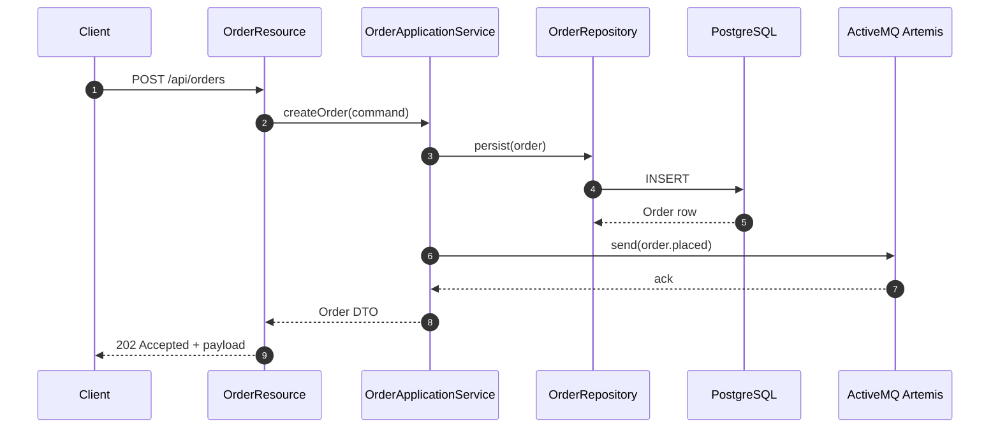
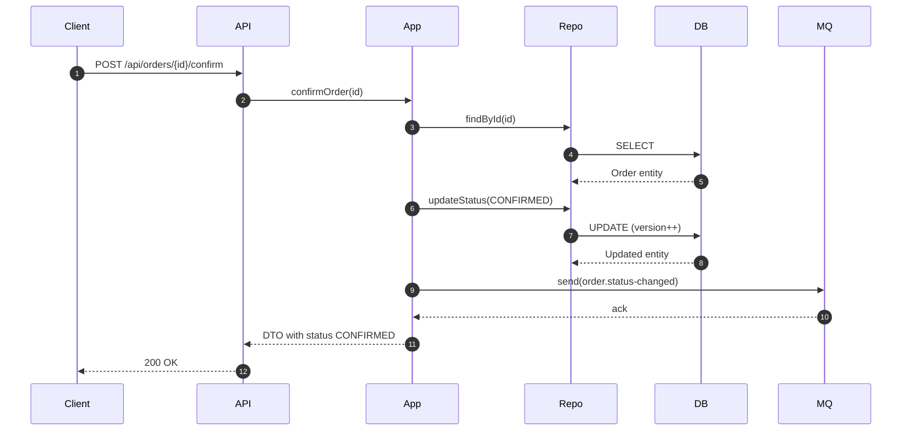

# Architecture - Third Microservice (Order Service)

## 1. Purpose & Scope
This document captures the **target architecture** for Microservice 3 (`order-service`). It will guide implementation, reviews, and documentation for Naloga 4. The service owns the preorder/order domain, exposes a reactive REST API, persists data independently, and publishes events via ActiveMQ Artemis so downstream services (notification, analytics) remain decoupled.

Key requirements satisfied by this architecture:
- Different technology stack (Quarkus 3 + Mutiny)
- Reactive HTTP + persistence pipeline
- Message broker integration (ActiveMQ)
- Structured logging + health endpoints
- Testability and CI/CD friendliness

## 2. Responsibilities
1. Accept and validate preorder requests for books
2. Persist order lifecycle state transitions (`PENDING`, `CONFIRMED`, `CANCELLED`, `FULFILLED`)
3. Publish domain events (`order.placed`, `order.status-changed`) to broker topics
4. Provide filtered queries for dashboards (by book, user, status)
5. Offer hooks for future payment and fulfillment integrations

Out of scope for MVP: actual payment capture, refunds, or complex saga coordination (these are future extensions).

## 3. Technology Stack
| Layer | Technology |
| --- | --- |
| Language / Runtime | Java 21, Quarkus 3 (Mutiny, Vert.x) |
| HTTP API | `quarkus-rest` (JAX-RS reactive), `SmallRye OpenAPI` |
| Persistence | PostgreSQL 15, Hibernate Reactive with Panache, Flyway migrations |
| Messaging | ActiveMQ Artemis, SmallRye Reactive Messaging (JMS connector) |
| Serialization | JSON (REST), JSON payloads for events |
| Validation | Jakarta Bean Validation |
| Logging/Observability | Quarkus logging-json, Micrometer Prometheus metrics, Health endpoints |
| Testing | JUnit 5, REST Assured, Testcontainers (PostgreSQL + Artemis) |

## 4. Component & Layer Diagram
```mermaid
digraph G {
  rankdir=LR;
  subgraph cluster_transport {
    label="Transport Layer";
    style=dashed;
    Api["OrderResource (REST)"];
    Filters["Request Filters\n(Mutiny + validation)"];
    Api -> Filters;
  }

  subgraph cluster_application {
    label="Application Layer";
    style=dashed;
    Service["OrderApplicationService\n(use cases)"];
    Mapper["OrderMapper"];
    Service -> Mapper;
  }

  subgraph cluster_domain {
    label="Domain Layer";
    style=dashed;
    Entity["Order aggregate"];
    Status["OrderStatus enum"];
    Repository["OrderRepository (Panache)"];
    Entity -> Status;
    Repository -> Entity;
  }

  subgraph cluster_infra {
    label="Infrastructure";
    style=dashed;
    DB["PostgreSQL 15\n(Hibernate Reactive)"];
    Broker["ActiveMQ Artemis"];
    Events["Reactive Messaging Channel"];
    Logger["Logging + Metrics"];
    Repository -> DB;
    Events -> Broker;
  }

  Api -> Service;
  Service -> Repository;
  Service -> Events;
  Service -> Logger;
}
```

**Flow summary**: HTTP request enters `OrderResource`, validated via bean validation + custom filters, handled by `OrderApplicationService`, which orchestrates persistence (through reactive repository) and event emission (through messaging channel). Observability hooks capture metrics/logs at each boundary.

## 5. Reactive Request Lifecycle
1. `OrderResource` exposes Mutiny-based endpoints returning `Uni<Response>`.
2. Validation occurs declaratively; errors short-circuit with 400 responses.
3. Application service composes reactive operations:
   - `repository.persist(order)` returns `Uni<Order>`
   - `Uni` chained with `onItem().call()` to emit broker events without blocking
4. Response is produced once DB write + event emission succeed. Failures propagate as `ProblemDetails` JSON via exception mapper.

## 6. Data Storage Design
- Single schema `orders` owned by service.
- Managed via Flyway migrations.
- Optimistic locking enabled with `@Version` column.
- Soft deletes are unnecessary; cancelled orders remain with `status=CANCELLED`.
- Indexes:
  - `idx_orders_book_id`
  - `idx_orders_user_id`
  - `idx_orders_status`

## 7. Messaging Integration
### Outgoing Topics
| Topic | Trigger | Payload |
| --- | --- | --- |
| `order.events` | New preorder created | `{ "eventType": "order.placed", "orderId": "UUID", "bookId": "UUID", "userId": "UUID", "quantity": 1, "price": 29.99, "createdAt": "ISO-8601" }` |
| `order.status` | Status mutation | `{ "eventType": "order.status-changed", "orderId": "UUID", "previous": "PENDING", "current": "CONFIRMED", "changedAt": "ISO-8601" }` |

### Delivery semantics
- Producer uses `@Outgoing` with `Emitter<Record<String, String>>`
- Messages acknowledged only after DB transaction success
- Use `message.id` header for idempotency downstream

### Broker deployment
- Local dev/test: Dockerized ActiveMQ Artemis on `tcp://localhost:61616`
- Credentials stored in `.env` and Quarkus config (`quarkus.artemis.username/password`)

## 8. Sequence Flows
### 8.1 Place Order


### 8.2 Confirm Order


## 9. Observability & Logging
- JSON logs with fields: `timestamp`, `level`, `message`, `requestId`, `orderId`, `bookId`, `durationMs`
- `RequestIdFilter` ensures each HTTP call has `X-Request-Id`
- Metrics: counters for orders per status, histogram for order creation latency, gauge for `pendingOrders`
- Health endpoints:
  - `/q/health/ready`: checks DB + broker connectivity
  - `/q/health/live`: confirms Vert.x event loop is alive

## 10. Deployment & Ports
| Component | Port (container) | Host mapping |
| --- | --- | --- |
| order-service HTTP | 8080 | 8083 (dev) |
| PostgreSQL | 5432 | 5440 |
| ActiveMQ Artemis | 61616 (JMS), 8161 (console) | 61616 / 8163 |

Docker Compose snippet will orchestrate the trio with dedicated network `orders-net` and named volumes for DB data.

## 11. Testing Strategy
1. **Unit**: Application services + validators (use `@InjectMock OrderRepository` + Mutiny `Uni` stubs)
2. **Repository**: Hibernate Reactive + Testcontainers PostgreSQL (ensures migrations + mappings)
3. **API**: `@QuarkusTest` + REST Assured hitting in-memory HTTP
4. **Messaging**: Testcontainers ActiveMQ verifying event emission counts/headers
5. **Contract**: OpenAPI snapshot + Schemathesis smoke (optional)

## 12. CI/CD Considerations
- Workflow caches Maven repo, runs `./mvnw -pl services/order-service -am test`
- Publish `surefire-reports` as artifact
- Optionally run `docker build` with `--target test`
- Future step: push image to GHCR once service stabilizes

## 13. Outstanding Questions (to resolve during implementation)
1. Do we need to call Book Service synchronously to verify the book exists? (If yes, add REST client with circuit breaker.)
2. Should we enforce idempotent create via client-provided `Idempotency-Key` header?
3. What retention policy do we expect for order events on ActiveMQ topics? (Default: durable, 7 days.)

Once these are clarified, update this doc to keep architecture and implementation aligned.
